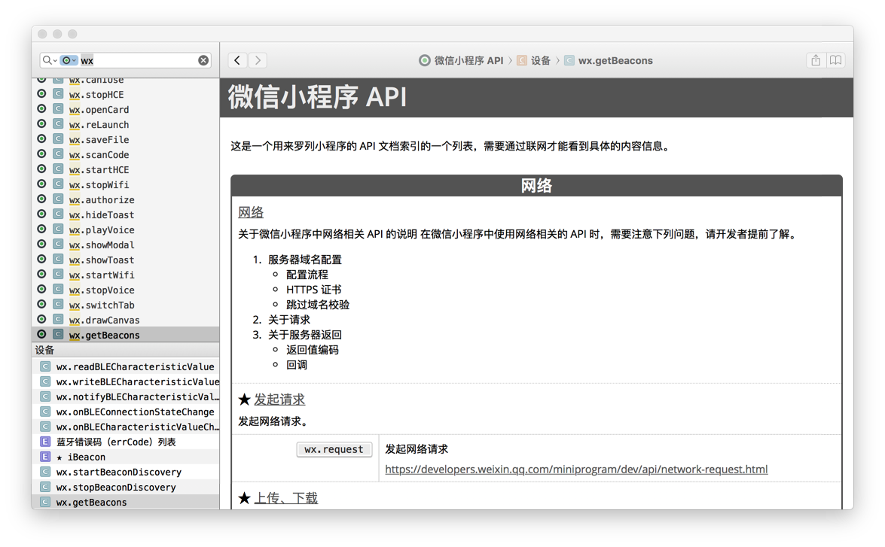

# dash_cheatSheets

自己整理的一个放在 dash 中使用的手册。

使用方式很简单，只需要在 Dash 中进入设置 `cmd+,`，然后添加下载后的手册文件，就可以了。

## wechatMiniProgram
简单整理了一下微信小程序中目前现有的一个 API 列表，主要是用于索引使用，最终还是需要在 Dash 中打开微信小程序官方文档的站点。

[点击下载](https://github.com/linxz/dash_cheatSheets/blob/master/wechatMiniProgram/wechatMiniProgram.docset.zip?raw=true)

原本想把这个提交到官方 Dash 中，然后这样或许以后有更新会方便点，不过官方目前不接受非英文的手册，所以，作罢，反正主要是为了满足自己的日常需求的（自我安慰一下）……